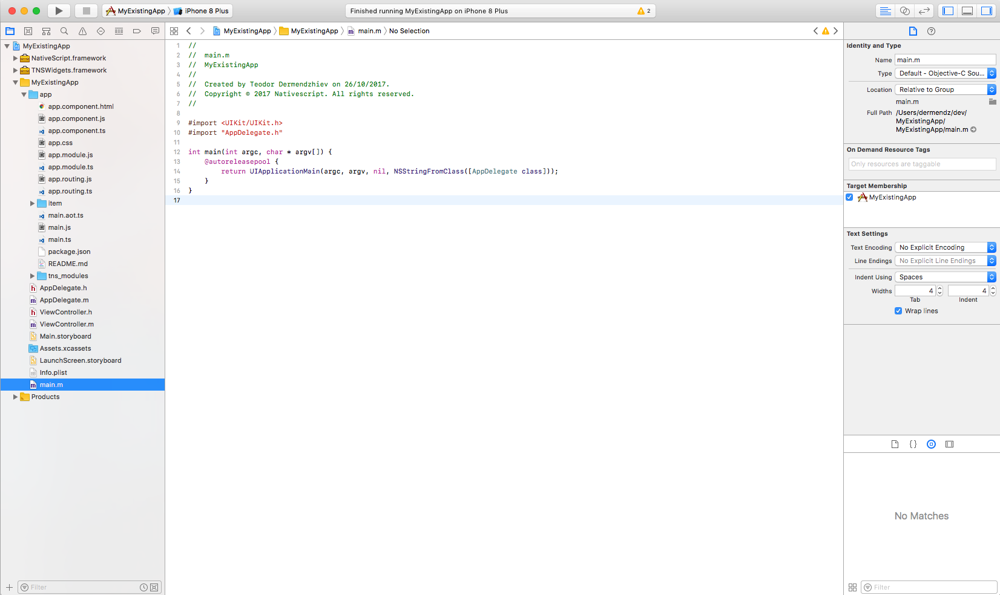
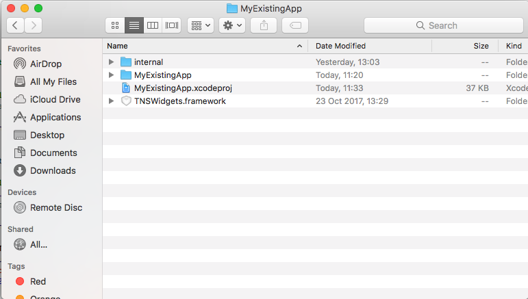
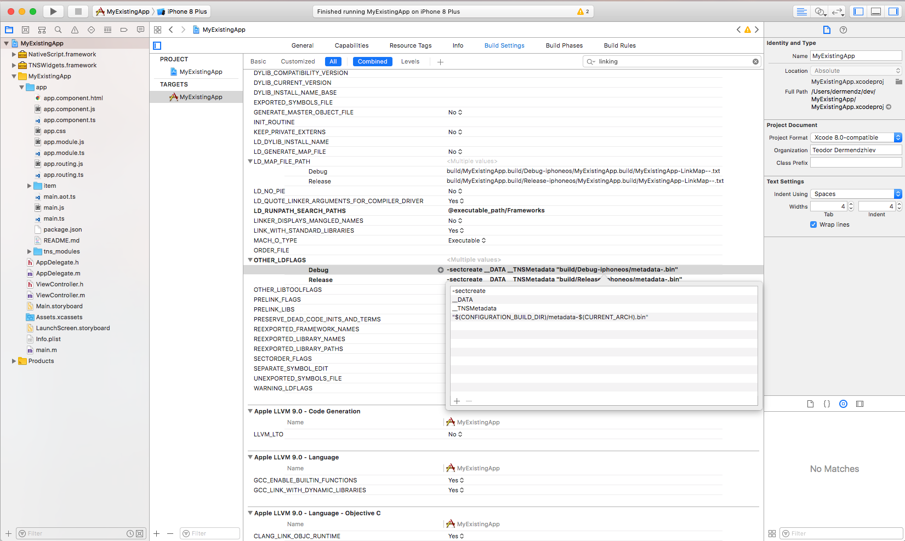
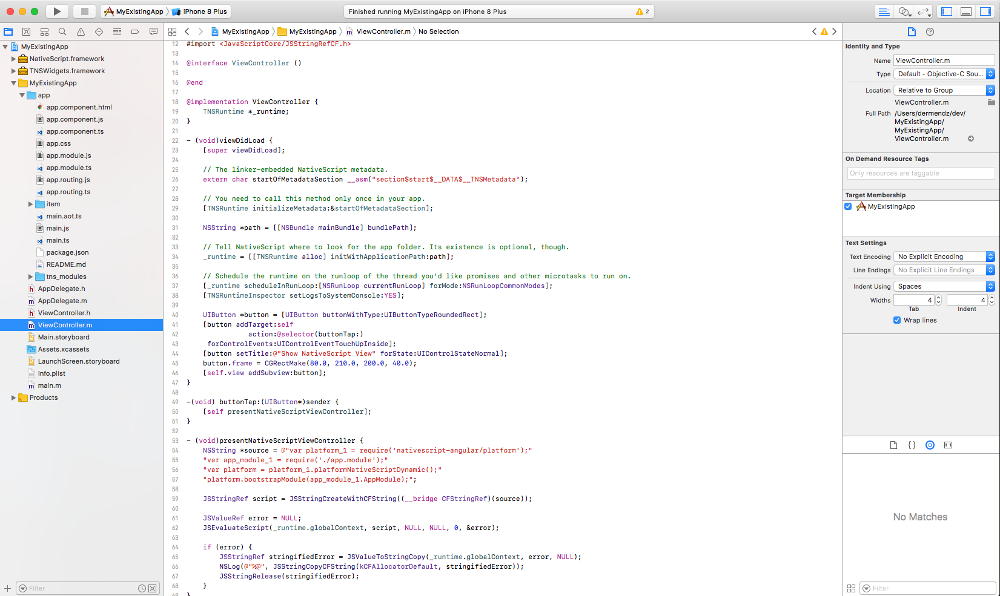

# Extend your existing iOS app with Angular and NativeScript

## Step-by-step instructions how to extend existing iOS app with Angular and NativeScript

1.Build your NativeScript app for iOS:
`tns build ios`

2.Copy your NativeScript app `\platforms\ios\YourAppName\app` folder to your iOS app:

3.Copy your NativeScript app `\platforms\ios\internal` folder next to your iOS app:

> Note: Both can be found in your NativeScript app `\platforms\ios\`and `\lib\ios\` folders.

4.Add reference to **NativeScript.framework** and **TNSWidgets.framework** (the former should be in the **internal** folder)

> Note: Both can be found in your NativeScript app `\platforms\ios\` and `\lib\ios\` folders.

5.Add **Run Script** and **Linker Flags** to build and use the metadata:

`cd "$PROJECT_DIR/internal/metadata-generator/bin" && ./build-step-metadata-generator.py`

`-sectcreate __DATA __TNSMetadata "$(CONFIGURATION_BUILD_DIR)/metadata-$(CURRENT_ARCH).bin"`

> Note: Run Script should be the first build phase.

6.Present NativeScript view controller from your app:

# Credits
[Extend your existing iOS app with Angular 2 and NativeScript](https://medium.com/@enchev/extend-your-existing-ios-app-with-angular-2-and-nativescript-c2225c9bf616)
